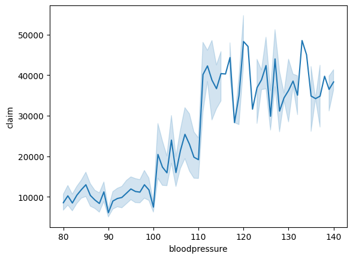
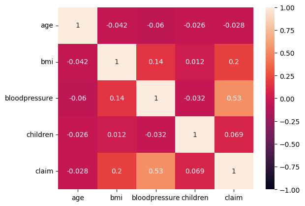
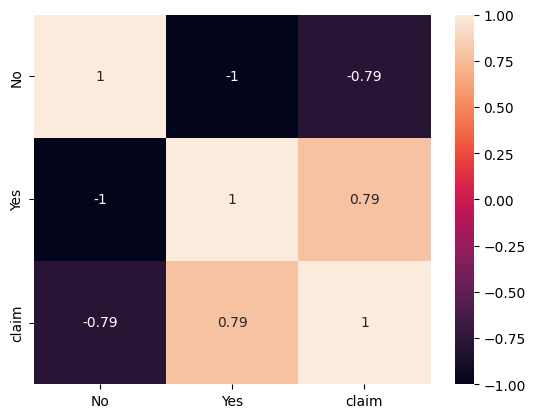
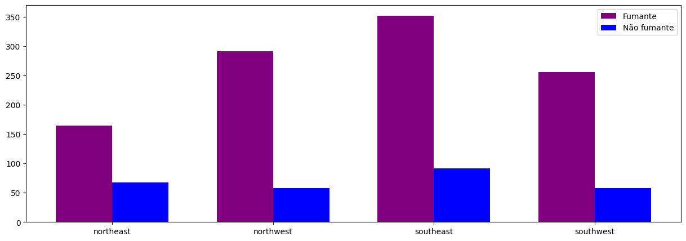
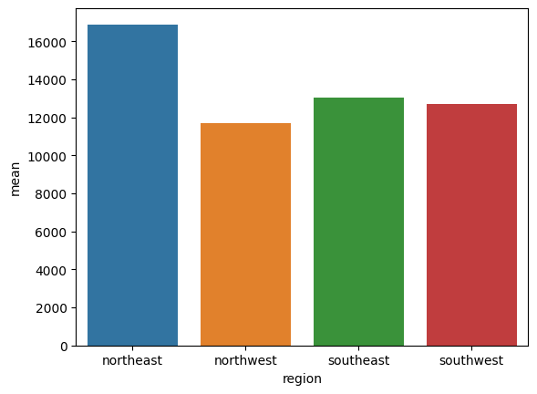
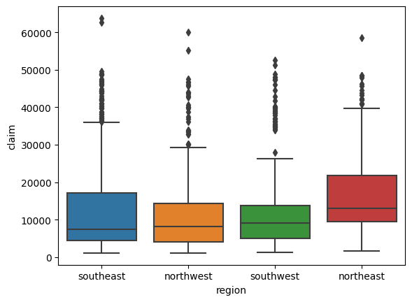

<h1 style="text-align: center;">Insurance-Claim-Analysis</h1>

Esse dataset contém informações relevantes relacionadas a reivindicação de seguros, nos dando um olhar profundo nos padrões demográficos daqueles que os recebem. O dataset contém informações da idade, genero, IMC (Indice de massa corporea), nível de pressão sanguínea, se possuí diabetes, número de filhos, se é fumante e a região do paciente. Analisando esses fatores chaves através das áreas geográficas e diferentes dados demográficos como idade e genero nós podemos adquirir um bom entendimento de quem são os mais propensos a receberem a reivindicação de seguro. Esse entendimento nos dá informações valiosas que podem ser usadas para nossas tomadas de decisões quando consideramos um potencial cliente para um dos nossos serviços.

<h2 style="text-align: center;">Resultados</h2>

Após algumas analises pela base de dados pude notar que a pressão sanguínea dos pacientes tem uma correlação levemente positiva com o valor da reivindicação de seguros deles, visualmente uma correlação quase linear entre os dados.

Segundo o site <a href="https://www.msdmanuals.com/pt/casa/distúrbios-do-coração-e-dos-vasos-sanguíneos/hipertensão-arterial/hipertensão-arterial#:~:text=A%20obesidade%2C%20o%20sedentarismo%2C%20o,hipertensão%20arterial%20não%20causa%20sintomas.">Manual MSD</a> um dos fatores para a alta pressão é justamente o tabagismo. Tendo isso em mente, converti meus dados categoricos da coluna de fumantes para uma variável Dummy para tentar encontrar alguma correlação com a reivindicação de seguro do paciente, e após isso, percebi uma forte correlação tanto positiva quanto negativa.

Após esses estudos concluo que, pessoas fumantes tendem a realizar uma reivindicação de seguro maior do que pessoas não fumantes, muito por conta da própria saúde que é prejudicada pelo próprio cigarro.

É interessante notar que mesmo Suldeste sendo a região com mais fumantes em relação as outras, o Nordeste se destaca com a média dos valores de reivindicação de seguro. Acredito que isso é muito por conta da própria população da região, é notado que a população de fumantes de Nordeste é equivalente a quase metade do todos daquela região, por isso que, a média para aquela região consta como maior do que as outras que possui uma percela menor de fumantes em comparação aos não fumantes.

<h2 style="text-align: center;">Modelos</h2>

Após essas conclusões decidi gerar um modelo preditivo que me retornasse o valor de reivindicação de seguro considerando os dados de ser ou não fumante e de pressão sanguínea. Testei apenas dois modelos, DecisionTreeRegressor e LinearRegressor, e dentre esse dois o que mais se destacou foi o DecisionTreeRegressor com os parametros 'tree__criterion': 'squared_error' e 'tree__max_depth': 3, parametros escolhidos manualmente para serem testados pelo SearchGrid da Pipeline. O Resultado final alcançado pelo modelo foi com uma accuracia de 70%.

---